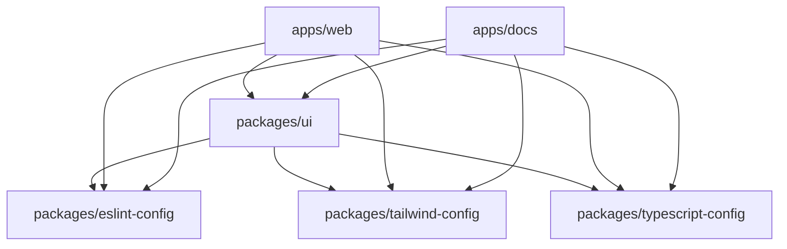

# Template Monorepo

> A modern monorepo template built with Turborepo, Next.js, and Tailwind CSS

## 🚀 Quick Start

### Prerequisites

- Node.js 18+ 
- pnpm 8+

### Installation

```bash
git clone <repository-url>
cd template
pnpm install
```

### Development

```bash
# Start all apps in development mode
pnpm dev

# Start specific app
pnpm --filter web dev
pnpm --filter docs dev
```

## 📦 Project Structure

```
template/
├── apps/
│   ├── web/              # Main web application
│   └── docs/             # Documentation site
├── packages/
│   ├── ui/               # Shared UI components
│   ├── eslint-config/    # ESLint configurations
│   ├── tailwind-config/  # Tailwind CSS configurations
│   └── typescript-config/ # TypeScript configurations
├── cli/                  # CLI tools
├── create-app.js         # App generation script
└── turbo.json           # Turborepo configuration
```

## 🛠️ Creating New Apps

Use the built-in app generator to create new applications:

```bash
# Create a web app
pnpm init:app my-web-app

# Create a docs app
pnpm init:app my-docs-app
```

The script automatically determines app type based on the name:
- Contains `-docs` → Documentation app
- Default → Web app

### What gets generated:

- ✅ Complete Next.js setup with TypeScript
- ✅ Pre-configured Tailwind CSS
- ✅ ESLint and TypeScript configs
- ✅ Shared UI components integration
- ✅ Turborepo optimization

## 🎨 UI Components

The `@repo/ui` package provides shared components:

```tsx
import { Button } from "@repo/ui/components/button";

export default function MyPage() {
  return <Button>Click me</Button>;
}
```

Available components:
- `Button` - Customizable button component
- `Card` - Card layout component
- More components can be added in `packages/ui/src/components/`

## 🔧 Available Scripts

### Root Commands

```bash
pnpm dev          # Start all apps in development
pnpm build        # Build all apps
pnpm lint         # Lint all packages
pnpm check-types  # Type check all packages
pnpm format       # Format code with Prettier
pnpm init:app     # Create new app
```

### App-specific Commands

```bash
pnpm --filter <app-name> <command>

# Examples:
pnpm --filter web dev
pnpm --filter docs build
pnpm --filter ui check-types
```

## 🏗️ Architecture

### Turborepo Benefits

- **Incremental builds** - Only rebuild what changed
- **Remote caching** - Share build artifacts across team
- **Parallel execution** - Run tasks across packages simultaneously
- **Dependency-aware** - Respect package dependencies

### Package Dependencies



## 🎯 Configuration

### ESLint

Shared ESLint configurations in `packages/eslint-config/`:
- `base.js` - Base TypeScript rules
- `nextjs.js` - Next.js specific rules
- `react.js` - React specific rules

### Tailwind CSS

Centralized Tailwind configuration in `packages/tailwind-config/`:
- Shared design tokens
- Custom color palette
- Responsive breakpoints

### TypeScript

Shared TypeScript configurations in `packages/typescript-config/`:
- `base.json` - Base TypeScript settings
- `nextjs.json` - Next.js specific settings
- `react-library.json` - React library settings

## 🚀 Deployment

### Build for Production

```bash
pnpm build
```

### Deploy Individual Apps

Each app in `apps/` can be deployed independently:

```bash
# Build specific app
pnpm --filter web build

# Deploy to your platform
cd apps/web
# Follow your deployment platform's instructions
```

## 🔄 Adding New Packages

1. Create new package directory:
```bash
mkdir packages/my-package
cd packages/my-package
```

2. Initialize package:
```bash
pnpm init
```

3. Update `package.json`:
```json
{
  "name": "@repo/my-package",
  "private": true,
  "exports": {
    ".": "./dist/index.js"
  }
}
```

4. Add to workspace dependencies where needed

## 🧪 Testing

Add testing framework of your choice:

```bash
# Example with Jest
pnpm add -D jest @types/jest

# Example with Vitest
pnpm add -D vitest @vitejs/plugin-react
```

## 📝 Development Workflow

1. **Start development**: `pnpm dev`
2. **Make changes** in any package
3. **Hot reload** automatically updates affected apps
4. **Type checking** runs in background
5. **Lint and format** before committing

## 🤝 Contributing

1. Fork the repository
2. Create a feature branch
3. Make your changes
4. Run `pnpm lint` and `pnpm check-types`
5. Submit a pull request

## 📄 License

MIT License - feel free to use this template for your projects!

## 🔗 Links

- [Turborepo Documentation](https://turborepo.org/docs)
- [Next.js Documentation](https://nextjs.org/docs)
- [Tailwind CSS Documentation](https://tailwindcss.com/docs)
- [TypeScript Documentation](https://www.typescriptlang.org/docs)